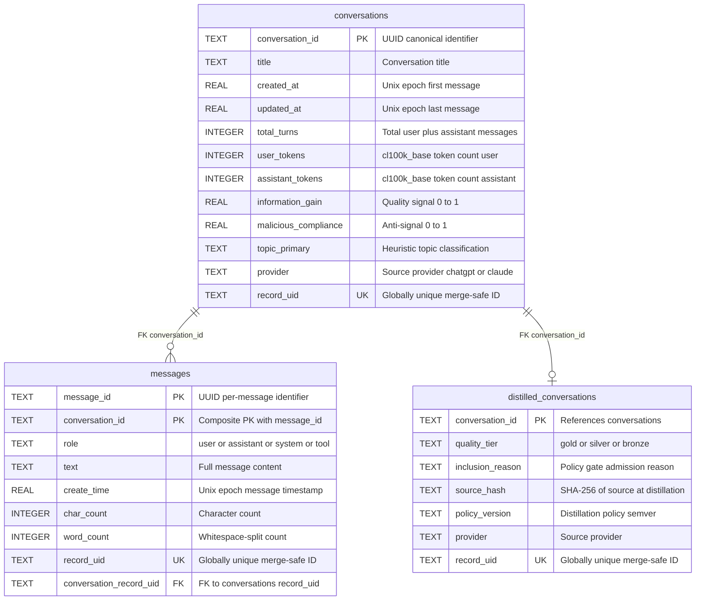
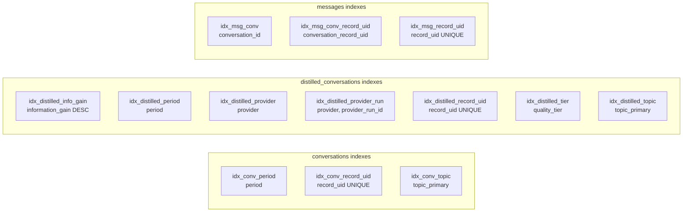

# Moonshine Mash — Data Architecture & Schema Specification

**Document Identifier:** `MASH-SCHEMA-SPEC-2026-02-26`  
**Authority Database:** `reports/main/moonshine_mash_active.db`  
**Provider Composition:** `chatgpt + claude`  
**Revision:** 2.0.0  
**Status:** ACTIVE — Production  
**Supersedes:** v1.0.0 (`moonshine_corpus.db` legacy spec)

---

## Table of Contents

- [1. Executive Summary](#1-executive-summary)
- [2. Data Model](#2-data-model)
- [3. Table Specifications](#3-table-specifications)
  - [3.1 conversations](#31-conversations--conversation-level-analytics)
  - [3.2 distilled_conversations](#32-distilled_conversations--quality-gated-subset)
  - [3.3 messages](#33-messages--message-level-payload)
- [4. Index Topology](#4-index-topology)
- [5. Provenance & Integrity Model](#5-provenance--integrity-model)
- [6. Canonical Query Contracts](#6-canonical-query-contracts)
- [7. Canonical Data Flow](#7-canonical-data-flow)
- [8. Module Responsibilities](#8-module-responsibilities)
- [9. Operational Rules](#9-operational-rules)
- [10. Revision History](#10-revision-history)

---

## 1. Executive Summary

`moonshine_mash_active.db` is the **single source of truth** for all Moonshine corpus analytics. It is a multi-provider SQLite store produced by merging provider-local forensics runs into a unified corpus through the main-lane layering protocol.

| Metric | Value |
|---|---|
| Tables | 3 |
| Total columns | 80 |
| Total rows | 179,160 |
| Indexes | 16 (3 unique) |
| Conversations | 2,196 |
| Distilled conversations | 1,978 (90.1% pass rate) |
| Messages | 174,986 |
| Providers merged | `chatgpt`, `claude` |

---

## 2. Data Model

### 2.1 Entity-Relationship Diagram



### 2.2 Relationship Semantics

| Relationship | Cardinality | Join Key | Semantics |
|---|---|---|---|
| `conversations` -> `messages` | 1:N | `conversation_id` | Every conversation contains one or more messages |
| `conversations` -> `distilled_conversations` | 1:0..1 | `conversation_id` | Quality-filtered subset; approximately 90% pass rate |
| `messages` -> `conversations` | N:1 | `conversation_record_uid` -> `record_uid` | Provenance-safe cross-provider join path |

---

## 3. Table Specifications

### 3.1 `conversations` — Conversation-Level Analytics

**Row Count:** 2,196  
**Column Count:** 33

| # | Column | Type | Key | Null | Description |
|---|--------|------|-----|------|-------------|
| 0 | `conversation_id` | TEXT | PK | NO | UUID — canonical conversation identifier |
| 1 | `title` | TEXT | | YES | User-visible conversation title or summary |
| 2 | `created_at` | REAL | | YES | Unix epoch — timestamp of first message |
| 3 | `updated_at` | REAL | | YES | Unix epoch — timestamp of last message |
| 4 | `total_turns` | INTEGER | | YES | Sum of user_turns and assistant_turns |
| 5 | `user_turns` | INTEGER | | YES | Count of role=user messages |
| 6 | `assistant_turns` | INTEGER | | YES | Count of role=assistant messages |
| 7 | `duration_minutes` | REAL | | YES | Derived: (updated_at - created_at) / 60 |
| 8 | `user_tokens` | INTEGER | | YES | cl100k_base token count for user messages |
| 9 | `assistant_tokens` | INTEGER | | YES | cl100k_base token count for assistant messages |
| 10 | `token_ratio` | REAL | | YES | Derived: assistant_tokens / max(user_tokens, 1) |
| 11 | `total_tokens` | INTEGER | | YES | Sum of user_tokens and assistant_tokens |
| 12 | `user_entropy` | REAL | | YES | Shannon entropy of user vocabulary distribution |
| 13 | `semantic_density` | REAL | | YES | Information-per-token proxy signal |
| 14 | `information_gain` | REAL | | YES | Quality score in range [0, 1] — higher is better |
| 15 | `repetition_score` | REAL | | YES | N-gram repetition ratio — lower is better |
| 16 | `tone_shift` | REAL | | YES | Tone delta across conversation duration |
| 17 | `malicious_compliance` | REAL | | YES | Anti-quality signal in range [0, 1] — lower is better |
| 18 | `topic_primary` | TEXT | IDX | YES | Heuristic primary topic label |
| 19 | `topic_secondary` | TEXT | | YES | Heuristic secondary topic label |
| 20 | `tone_cluster` | TEXT | | YES | Affective tone cluster assignment |
| 21 | `code_blocks` | INTEGER | | YES | Count of fenced code blocks detected |
| 22 | `terminal_outputs` | INTEGER | | YES | Count of terminal/shell output blocks |
| 23 | `tables` | INTEGER | | YES | Count of markdown tables detected |
| 24 | `manifests` | INTEGER | | YES | Count of inline JSON manifests |
| 25 | `correction_events` | INTEGER | | YES | User-initiated correction event count |
| 26 | `period` | INTEGER | IDX | YES | Temporal bucket formatted as YYYYMM |
| 27 | `provider` | TEXT | | YES | Source provider identifier (chatgpt, claude) |
| 28 | `provider_run_id` | TEXT | | YES | Forensics pipeline run that produced this row |
| 29 | `source_file_sha256` | TEXT | | YES | SHA-256 hash of ingested source file |
| 30 | `source_path` | TEXT | | YES | Filesystem path at time of ingestion |
| 31 | `ingested_at` | TEXT | | YES | ISO-8601 ingestion timestamp |
| 32 | `record_uid` | TEXT | UQ | YES | Globally unique merge-safe identifier |

**Column Categories:**

- **Identity (0-1):** Canonical identifiers
- **Timing (2-3):** Temporal bounds
- **Interaction (4-7):** Turn counts and session duration
- **Tokens (8-11):** Token-level accounting
- **Quality (12-17):** Signal and anti-signal metrics
- **Content (18-20):** Topic and tone classification
- **Artifacts (21-25):** Structural element counts
- **Temporal (26):** Period bucketing for timeline queries
- **Provenance (27-32):** Merge-tracking and audit trail

---

### 3.2 `distilled_conversations` — Quality-Gated Subset

**Row Count:** 1,978 (90.1% of conversations pass distillation)  
**Column Count:** 32

Distillation policy filters conversations through quality gates based on information gain, malicious compliance, and token thresholds. Only rows passing all gates are admitted. Each row carries full provenance metadata linking it to the source conversation and the distillation run that produced it.

| # | Column | Type | Key | Null | Description |
|---|--------|------|-----|------|-------------|
| 0 | `conversation_id` | TEXT | PK | NO | References conversations.conversation_id |
| 1 | `title` | TEXT | | YES | Conversation title |
| 2 | `created_at` | REAL | | YES | Unix epoch — first message |
| 3 | `updated_at` | REAL | | YES | Unix epoch — last message |
| 4 | `total_turns` | INT | | YES | Total message count |
| 5 | `user_turns` | INT | | YES | User message count |
| 6 | `assistant_turns` | INT | | YES | Assistant message count |
| 7 | `total_tokens` | INT | | YES | Aggregate token count |
| 8 | `user_tokens` | INT | | YES | User-side token count |
| 9 | `assistant_tokens` | INT | | YES | Assistant-side token count |
| 10 | `token_ratio` | REAL | | YES | Assistant-to-user ratio |
| 11 | `information_gain` | REAL | IDX | YES | Quality signal — indexed DESC for fast ranking |
| 12 | `malicious_compliance` | REAL | | YES | Anti-quality signal |
| 13 | `user_entropy` | REAL | | YES | Vocabulary entropy |
| 14 | `semantic_density` | REAL | | YES | Information-per-token proxy |
| 15 | `repetition_score` | REAL | | YES | N-gram repetition ratio |
| 16 | `correction_events` | INT | | YES | Correction event count |
| 17 | `topic_primary` | TEXT | IDX | YES | Primary topic classification |
| 18 | `tone_cluster` | TEXT | | YES | Affective tone cluster |
| 19 | `period` | INT | IDX | YES | YYYYMM temporal bucket |
| 20 | `source_hash` | TEXT | | NO | SHA-256 of source record at time of distillation |
| 21 | `distilled_at` | TEXT | | NO | ISO-8601 timestamp of distillation |
| 22 | `policy_version` | TEXT | | NO | Semantic version of distillation policy applied |
| 23 | `run_id` | TEXT | | NO | Unique distillation run identifier |
| 24 | `quality_tier` | TEXT | IDX | NO | Classification: gold, silver, or bronze |
| 25 | `inclusion_reason` | TEXT | | NO | Policy gate that admitted this row |
| 26 | `provider` | TEXT | IDX | YES | Source provider identifier |
| 27 | `provider_run_id` | TEXT | IDX | YES | Composite-indexed with provider |
| 28 | `source_file_sha256` | TEXT | | YES | Source file hash |
| 29 | `source_path` | TEXT | | YES | Ingestion filesystem path |
| 30 | `ingested_at` | TEXT | | YES | ISO-8601 ingestion timestamp |
| 31 | `record_uid` | TEXT | UQ | YES | Globally unique merge-safe identifier |

**Column Categories:**

- **Identity (0-1):** Conversation linkage
- **Timing (2-3):** Temporal bounds
- **Interaction (4-6):** Turn counts
- **Tokens (7-10):** Token accounting
- **Quality (11-15):** Signal metrics
- **Artifacts (16):** Correction tracking
- **Content (17-18):** Classification
- **Temporal (19):** Period bucketing
- **Distillation (20-25):** Policy metadata (all NOT NULL)
- **Provenance (26-31):** Merge-tracking and audit trail

---

### 3.3 `messages` — Message-Level Payload

**Row Count:** 174,986  
**Column Count:** 15

| # | Column | Type | Key | Null | Description |
|---|--------|------|-----|------|-------------|
| 0 | `message_id` | TEXT | PK1 | NO | UUID — message-level identifier |
| 1 | `conversation_id` | TEXT | PK2, IDX | NO | Composite PK; foreign key to conversations |
| 2 | `conversation_title` | TEXT | | YES | Denormalized title for fast display rendering |
| 3 | `role` | TEXT | | YES | Message author role: user, assistant, system, tool |
| 4 | `text` | TEXT | | YES | Full message content (unbounded length) |
| 5 | `create_time` | REAL | | YES | Unix epoch — message sent timestamp |
| 6 | `char_count` | INTEGER | | YES | Character count of text field |
| 7 | `word_count` | INTEGER | | YES | Whitespace-delimited word count |
| 8 | `provider` | TEXT | | YES | Source provider identifier |
| 9 | `provider_run_id` | TEXT | | YES | Forensics run identifier |
| 10 | `source_file_sha256` | TEXT | | YES | SHA-256 hash of source file |
| 11 | `source_path` | TEXT | | YES | Filesystem path at ingestion time |
| 12 | `ingested_at` | TEXT | | YES | ISO-8601 ingestion timestamp |
| 13 | `record_uid` | TEXT | UQ | YES | Globally unique merge-safe identifier |
| 14 | `conversation_record_uid` | TEXT | IDX | YES | Foreign key to conversations.record_uid |

---

## 4. Index Topology

### 4.1 Complete Index Catalog



### 4.2 Access Pattern Coverage Matrix

| Access Pattern | Covered | Index |
|---|---|---|
| Lookup conversation by ID | YES | PK autoindex |
| Filter conversations by topic | YES | `idx_conv_topic` |
| Filter conversations by period | YES | `idx_conv_period` |
| Rank distilled by information_gain | YES | `idx_distilled_info_gain` (DESC) |
| Filter distilled by quality_tier | YES | `idx_distilled_tier` |
| Filter distilled by provider | YES | `idx_distilled_provider` |
| Filter distilled by provider + run | YES | `idx_distilled_provider_run` (composite) |
| Filter distilled by topic | YES | `idx_distilled_topic` |
| Filter distilled by period | YES | `idx_distilled_period` |
| Merge-safe UID lookup (all tables) | YES | `idx_*_record_uid` (UNIQUE) |
| Messages by conversation_id | YES | `idx_msg_conv` |
| Messages by conversation_record_uid | YES | `idx_msg_conv_record_uid` |
| Full-text search on message content | NO | No FTS index present |
| Filter by tone_cluster | NO | Not indexed |
| Filter by correction_events | NO | Not indexed |

---

## 5. Provenance & Integrity Model

Every row in every table carries a **six-column provenance envelope** enabling full audit traceability across multi-provider merges.

| Column | Purpose | Enforcement |
|---|---|---|
| `provider` | Source system identifier | Enumerated: chatgpt, claude, deepseek, qwen |
| `provider_run_id` | Forensics pipeline execution that generated this row | Immutable after write |
| `source_file_sha256` | Cryptographic hash of ingested source file | Validates source integrity |
| `source_path` | Filesystem path at time of ingestion | Audit trail reference |
| `ingested_at` | ISO-8601 timestamp of ingestion event | Temporal ordering |
| `record_uid` | Globally unique merge-safe identifier | UNIQUE constraint — prevents duplicate ingestion |

### 5.1 Merge Invariants

1. **Single-provider-at-a-time merge** — concurrent multi-provider writes are prohibited
2. **record_uid uniqueness** enforced at database level across all three tables
3. **Pre-merge archive** required before every live merge operation
4. **Post-merge verification** validates provider composition and record_uid uniqueness
5. **Immutable source** — raw export files are never modified in place

---

## 6. Canonical Query Contracts

### Contract A: High-Signal Training Candidates

```sql
SELECT conversation_id, title, information_gain, malicious_compliance,
       quality_tier, provider, total_tokens
FROM   distilled_conversations
WHERE  information_gain > 0.58
  AND  malicious_compliance < 0.25
ORDER BY information_gain DESC;
```

### Contract B: Correction Events for DPO Mining

```sql
SELECT conversation_id, title, correction_events, topic_primary, provider
FROM   conversations
WHERE  topic_primary = 'debugging'
  AND  correction_events > 0
ORDER BY correction_events DESC;
```

### Contract C: Period-by-Period Trend Analysis

```sql
SELECT period,
       COUNT(*)                      AS conv_count,
       AVG(information_gain)         AS avg_info_gain,
       AVG(token_ratio)              AS avg_token_ratio,
       SUM(correction_events)        AS correction_total
FROM   conversations
GROUP BY period
ORDER BY period;
```

### Contract D: Conversation Drilldown

```sql
SELECT role, text, create_time, char_count, word_count
FROM   messages
WHERE  conversation_id = :cid
ORDER BY create_time;
```

### Contract E: Provider Composition Audit

```sql
SELECT provider,
       COUNT(*)          AS conversations,
       SUM(total_tokens) AS total_tokens
FROM   conversations
GROUP BY provider;
```

### Contract F: Quality Tier Distribution

```sql
SELECT quality_tier,
       COUNT(*)                  AS count,
       AVG(information_gain)     AS avg_gain,
       AVG(total_tokens)         AS avg_tokens
FROM   distilled_conversations
GROUP BY quality_tier
ORDER BY avg_gain DESC;
```

---

## 7. Canonical Data Flow

```text
Raw Exports (immutable)
  02-14-26-ChatGPT/conversations.json
  claude-export/conversations.json
        |
        v
Forensics Ingestion + Normalization
  dataset_forensics/cli.py
  dataset_forensics/ingestion.py
  dataset_forensics/normalization.py
  dataset_forensics/tokenization.py
  dataset_forensics/metadata.py
  dataset_forensics/dedup.py
  dataset_forensics/quality.py
        |
        v
Provider-Local Outputs (reports/providers/<provider>/<run_id>/)
  moonshine_<provider>_<run_id>.db
  moonshine_corpus_report.<provider>.<run_id>.md
  moonshine_distillation_manifest.<provider>.<run_id>.json
  token_ledger.<provider>.<run_id>.json
        |
        v
Main-Lane Merge (one provider at a time)
  merge into reports/main/moonshine_mash_active.db
  archive before every merge
  verify record_uid uniqueness post-merge
        |
        v
Visual Intelligence
  moonshine_visualizer.py -> visualizations/*.png
```

---

## 8. Module Responsibilities

### `dataset_forensics/cli.py`

Orchestrates end-to-end forensics runs: config loading, deterministic run IDs, structured logging, output generation, and manifest checksums.

### `dataset_forensics/ingestion.py`

Handles input format detection and streaming parse for large JSON/JSONL sources. Never loads the full export into memory.

### `dataset_forensics/normalization.py`

Applies deterministic text normalization: Unicode canonicalization, whitespace collapse, line ending standardization, and control character removal.

### `dataset_forensics/tokenization.py`

Computes tokenizer-specific counts and benchmarks using cl100k_base and other configured tokenizers.

### `dataset_forensics/metadata.py`

Computes row-level metadata and hashes for sample-level tracking and identity verification.

### `dataset_forensics/dedup.py`

Executes exact and near-duplicate detection for corpus cleanliness analytics.

### `dataset_forensics/quality.py`

Computes entropy, repetition, information-gain proxy, anomaly flags, and risk indicators.

### `moonshine_corpus_analyzer.py`

Builds the Moonshine semantic, quality, and timeline dataset. Writes the provider-local SQLite database and markdown report. Implements the DistillationPolicy that gates rows into distilled_conversations.

### `moonshine_visualizer.py`

Renders publication-ready visualizations from SQLite: topic distribution, quality metrics over periods, token ratio distribution, correction-vs-quality scatter, period comparison, and corpus dashboard.

---

## 9. Operational Rules

### 9.1 Runtime Environment

All Python operations must use the project virtual environment:

```
.\.venv\Scripts\python.exe <script>
```

Global Python must not be used for merge, analyzer, or forensics operations.

### 9.2 Performance and Streaming

- Never load the full raw export into memory during processing
- Use parser iteration and batching from the forensics pipeline
- Keep raw source files immutable
- Write intermediate artifacts to `reports/` and visuals to `visualizations/`
- Use manifest and checksums for reproducibility

### 9.3 Output Standards

Every production run must produce:

- Detailed terminal and runtime logs in `reports/logs/`
- Machine-readable manifest in `reports/repro_manifest.json`
- Analytical markdown summary in `reports/*.md`
- Queryable SQLite database in `reports/main/moonshine_mash_active.db`
- Visual assets in `visualizations/*.png`

### 9.4 Documentation Sync Rule

After each main-lane merge, update the following in the same pass:

1. `TOKEN_FORENSICS_README.md`
2. `AGENTS.md`
3. `PROJECT_MOONSHINE_UPDATE_1.md`
4. `reports/CURRENT_REPORTS_FILETREE.md`
5. `CONTEXT.md` and `MEMORY.md`

---

## 10. Revision History

| Version | Date | Summary |
|---|---|---|
| 2.0.0 | 2026-02-26 | Complete rewrite targeting `moonshine_mash_active.db`. Added `distilled_conversations` table spec, full provenance envelope, index topology, access pattern coverage matrix, and multi-provider merge documentation. |
| 1.0.0 | 2026-02-15 | Initial spec targeting legacy `moonshine_corpus.db` with two-table schema. |
