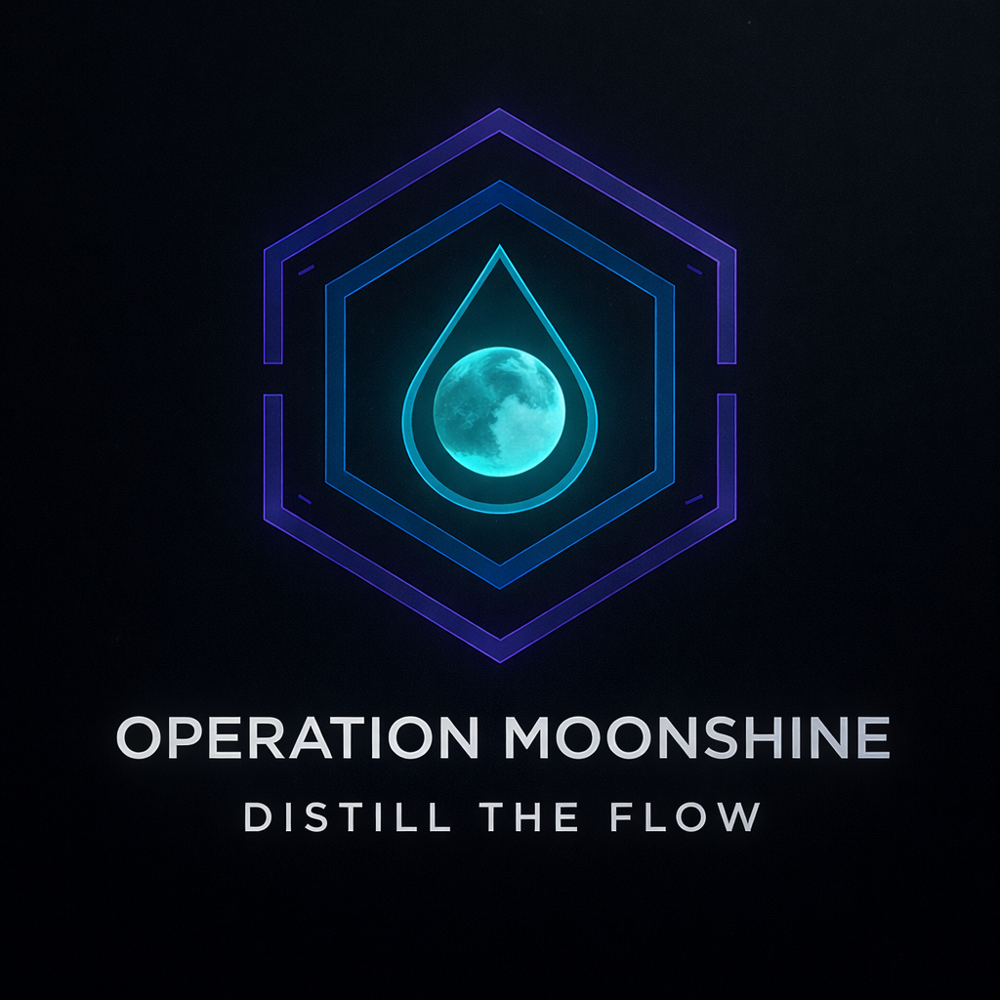
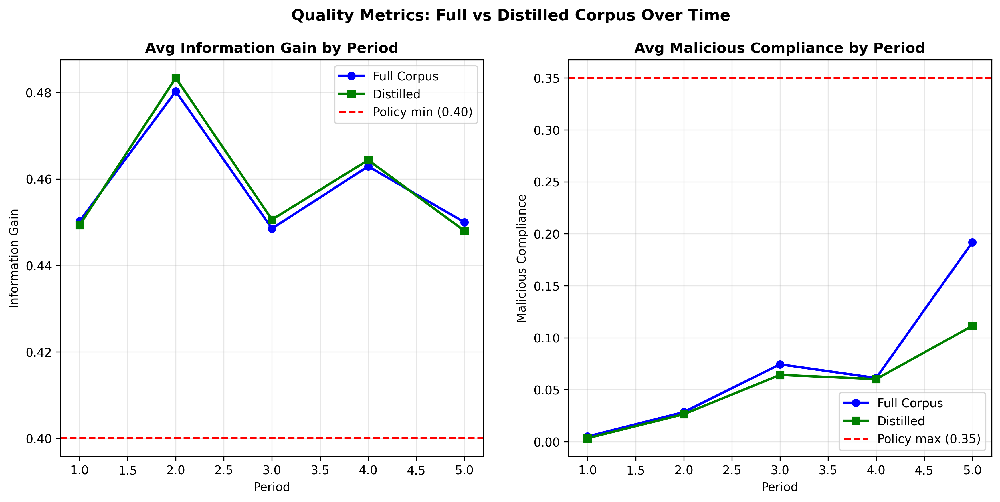
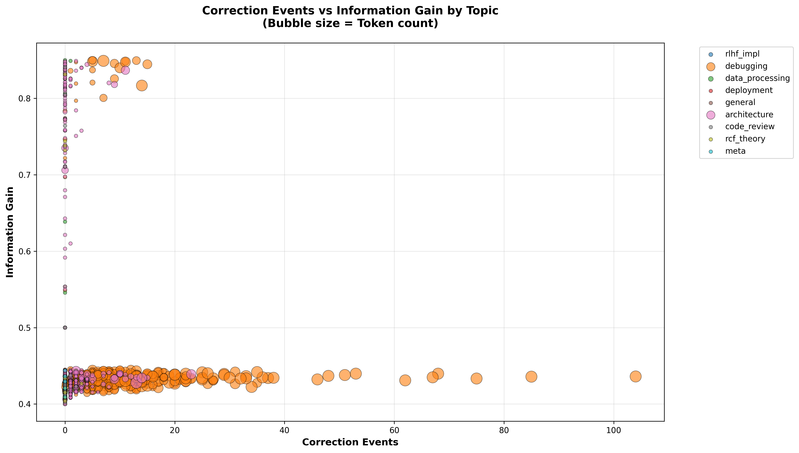
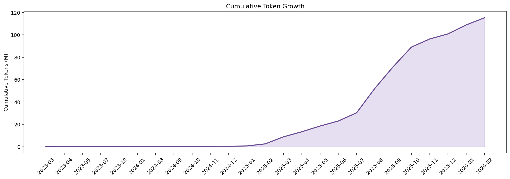
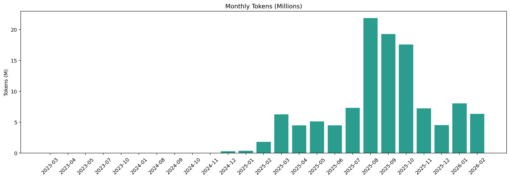
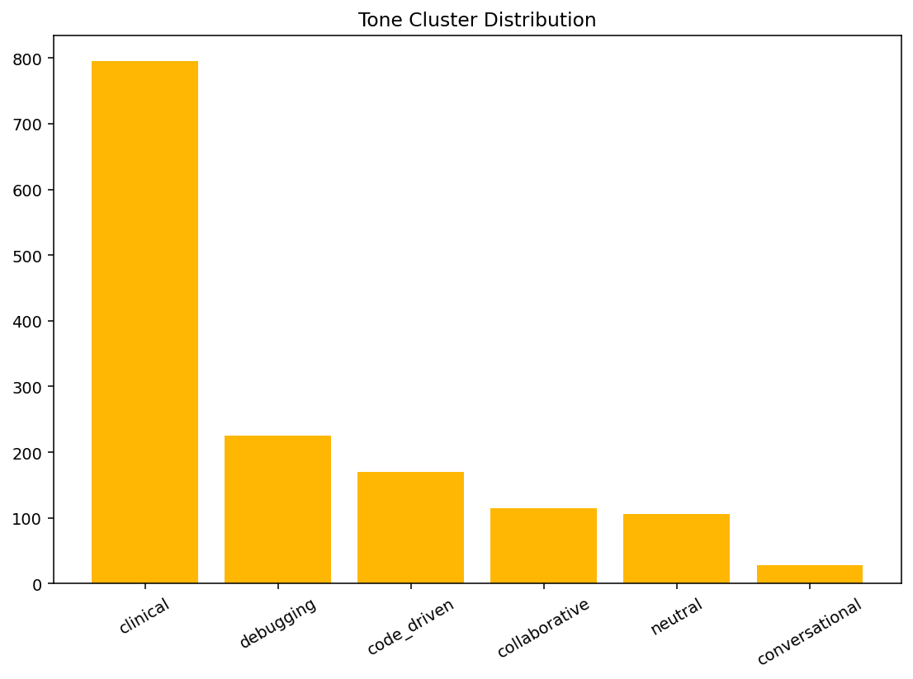
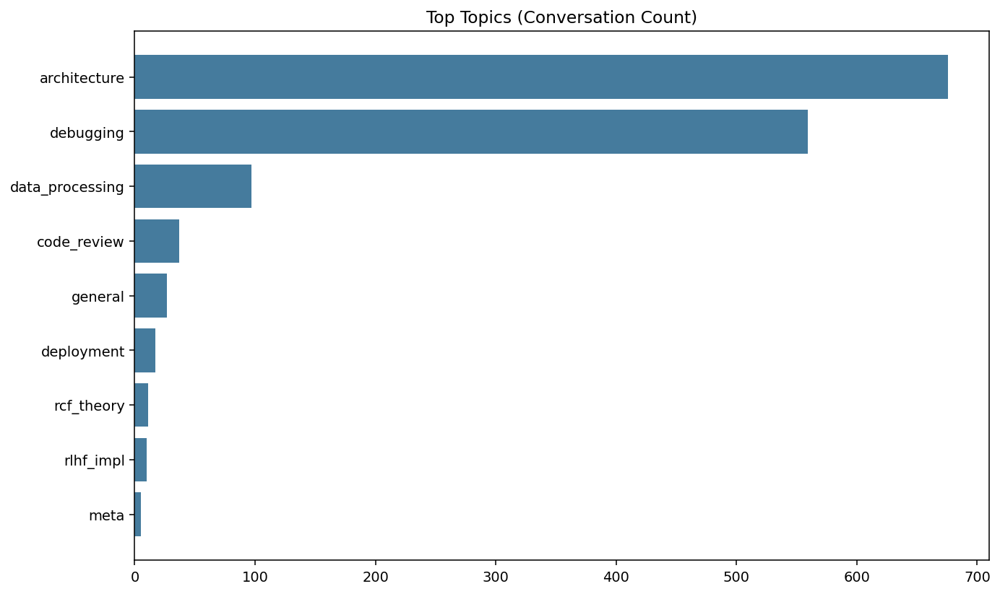
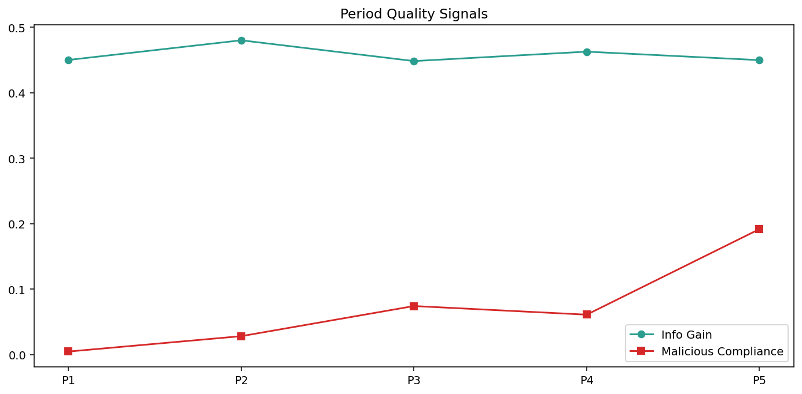
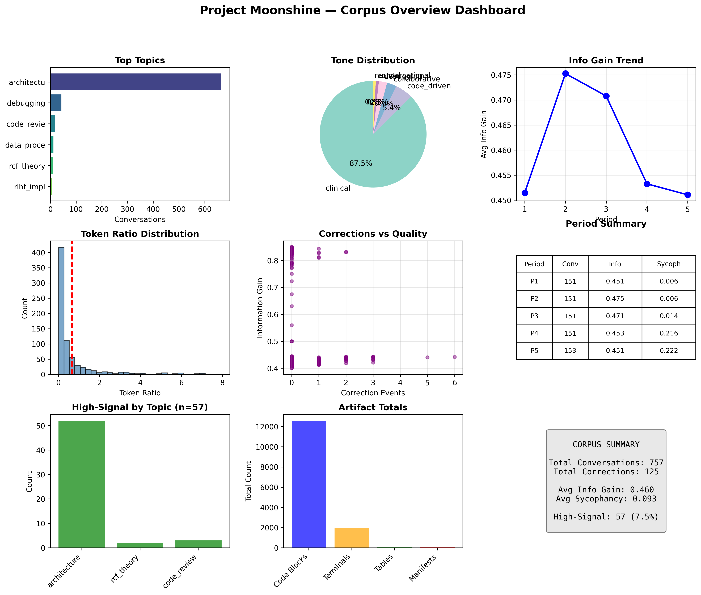

<div align="center">
  
  <h1>Operation Moonshine</h1>
  <p><strong>Distill the Flow</strong></p>
  <p>OpsOTA Drop 3: Corpus Forensics and Distillation Infrastructure</p>
  <p><a href="https://github.com/calisweetleaf/Reinforcement-Learning-Full-Pipeline">Drop 1: Reinforcement-Learning-Full-Pipeline</a></p>
  <p><a href="https://github.com/calisweetleaf/SOTA-Runtime-Core">Drop 2: SOTA-Runtime-Core</a></p>
  <p><a href="https://github.com/calisweetleaf/distill-the-flow">Drop 3: distill-the-flow</a></p>
  <p><a href="https://github.com/calisweetleaf/somnus-license/blob/main/LICENSE">Somnus License (Repository Governing Terms)</a></p>
</div>

---
## Mission Statement

This toolkit delivers **best-in-class token forensics** for training data preparation. No MVP shortcuts — production-grade analysis with strict verification gates, reproducibility-first design, and zero safety filtering.

Objectives:

- **Token Intelligence**: Multi-tokenizer analysis, drift detection, context-fit modeling
- **Quality Diagnostics**: Readability, entropy, repetition, boilerplate detection
- **Deduplication Analytics**: Exact, near-dup, semantic clustering
- **Training Cost Projections**: Per-model family cost modeling
- **PII & Safety Scanning**: Heuristic-based detection with confidence scoring
- **Reproducibility**: Cryptographic hashing, machine-readable manifests

---

## The Corpus

This pipeline was built to distill something specific: **13 months of working research conversations**, January 2025 through February 2026, captured across two AI providers in parallel.

These are not general-purpose chat logs. They are the working record of an individual developer designing and building a post-token frequency-based architecture — one that deliberately merges symbolic AI lineage (semantic frames, predicate logic, early-2000s NLP), connectionist foundations (1980s–90s neural networks), and modern LLM infrastructure into something the field does not currently have a name for. The conversations capture architecture decisions, failure modes, multi-turn debugging of novel systems, correction events, and live theoretical development across domains that rarely appear together in publicly available training data.

### Provider Timeline

Both providers cover the same 13-month window: **January 2025 → February 2026.**

| Provider | Export Structure | Date Range | Conversations | Messages | Exact Tokens (o200k\_base) |
|----------|-----------------|------------|:---:|:---:|---:|
| chatgpt | Single clean export | Jan 2025 — Feb 14, 2026 | 1,439 | 169,397 | 115,334,978 |
| claude | Two exports merged (split at Aug 2025) | Jan 2025 — Aug 5, 2025 + Aug 5, 2025 — Feb 2026 | 954 | 7,726 | 4,791,566 |
| deepseek | Supplementary | 2025–2026 | 320 | 2,073 | 1,482,829 |
| qwen | Supplementary | 2025–2026 | 75 | 778 | 1,017,719 |

**ChatGPT** is one continuous export — no gaps, no splits, the full span in a single file. **Claude** required two separate exports because the platform's export window was bounded: the first covered January through early August 2025, the second picked up from August 5 through February 2026. Both were ingested separately, validated individually with source-hash locking, then merged into a single Claude provider run in the main mash DB. The combined Claude lane covers the same full 13 months as the ChatGPT lane, with provenance kept intact for every message.

The result is **122,627,092 exact non-system tokens** across **2,788 conversations** and **179,974 messages**, with **110,539,045 tokens** surviving quality-gated distillation into the training-ready subset.

### What Makes This Corpus Unusual

**Technical density.** 85.8% of conversations are classified as architecture or debugging. This is not a mixed-use general corpus — it is a technical corpus built from sustained, goal-directed work sessions. Average code block density: 60.5 per conversation. Average terminal output density: 31.6 per conversation.

**Near-zero sycophancy.** Mean malicious compliance score: 0.073 (scale 0–1). The conversations are not validation-seeking exchanges. They are genuine technical problem-solving sessions where the model pushes back, corrects, and sometimes fails. This makes them structurally different from most human preference datasets.

**Correction density.** 41.3% of ChatGPT conversations contain at least one explicit correction event — 4,413 correction events total across 594 conversations. These are direct preference optimization candidates: the corpus contains the explicit signal of what was wrong and what the corrected version looked like, in context.

**Longitudinal coherence.** The same operator worked with both providers across the same period on the same problems. This produces a cross-model validation surface: identical theoretical questions received by two different model families, allowing comparison of reasoning style, failure modes, and output quality against a shared ground truth.

**Domain specificity.** RCF theory, eigenrecursion, HSGM, holographic memory models, frequency-domain neural architectures, TGP compiler design, and multi-agent orchestration systems appear throughout. This terminology and the extended reasoning chains around it do not exist in publicly available datasets at scale.

### Corpus Visualizations

**Quality metrics over time (ChatGPT, 5 temporal periods):**


Information gain rises from Period 1 (0.450) through Period 2 peak (0.480), stabilizes, and returns to baseline by Period 5. The trajectory reflects a corpus that is consistently productive rather than episodically brilliant — sustained, methodical work rather than scattered bursts.

**Distilled corpus quality timeseries:**



**Topic distribution:**


**Period-over-period comparison:**


**Corrections scatter (DPO candidate surface):**



**Token ratio distribution (user-to-assistant balance):**


**Corpus overview dashboard:**


**Distilled corpus dashboard:**


**Extended analytics — cumulative token growth:**



**Extended analytics — monthly token volume:**



**Extended analytics — tone cluster distribution:**



**Extended analytics — top topics:**



**Extended analytics — period quality signals:**



**Claude provider corpus overview:**



---

## Table of Contents

- [Architecture](#architecture)
- [Installation](#installation)
- [Quick Start](#quick-start)
- [Output Artifacts](#output-artifacts)
- [Agent Specifications](#agent-specifications)
- [Delta vs Prior Art](#delta-vs-prior-art)
- [Configuration](#configuration)
- [Extending the Pipeline](#extending-the-pipeline)
- [Citation](#citation)

---

## Architecture

The pipeline orchestrates **7 specialized agents** running in dependency-aware parallel execution:

```
┌──────────────────────────────────────────────────────────────────────┐
│                    Token Forensics Orchestrator                      │
├──────────────────────────────────────────────────────────────────────┤
│                                                                      │
│  Phase 1: Parallel Forensic Analysis (6 agents)                     │
│  ┌────────────────────┐  ┌────────────────────┐                     │
│  │ DataProfilerAgent  │  │MultiTokenizerAgent │                     │
│  │ - Schema mapping   │  │ - GPT-4/Llama/etc  │                     │
│  │ - Language detect  │  │ - Context fit      │                     │
│  │ - Split analysis   │  │ - Drift analysis   │                     │
│  └────────────────────┘  └────────────────────┘                     │
│                                                                     │
│  ┌────────────────────┐  ┌────────────────────┐                     │
│  │QualityScoringAgent │  │  SafetyPIIAgent    │                     │
│  │ - Readability      │  │ - Email/phone/SSN  │                     │
│  │ - Entropy          │  │ - API keys         │                     │
│  │ - Repetition       │  │ - Risk scoring     │                     │
│  └────────────────────┘  └────────────────────┘                     │
│                                                                     │
│  ┌────────────────────┐  ┌────────────────────┐                     │
│  │    DedupAgent      │  │  CostModelAgent    │                     │
│  │ - Exact (SHA256)   │  │ - Training cost    │                     │
│  │ - Near-dup         │  │ - Inference cost   │                     │
│  │ - Semantic cluster │  │ - Per model family │                     │
│  └────────────────────┘  └────────────────────┘                     │
│                                                                     │
│  Phase 2: Verification (serial, requires all Phase 1 results)       │
│  ┌────────────────────────────────────────────────────────────┐     │
│  │                    VerifierAgent                           │     │
│  │  - Artifact completeness check                             │     │
│  │  - Schema integrity validation                             │     │
│  │  - Count consistency verification                          │     │
│  │  - Reproducibility hash generation                         │     │
│  │  - Quality gate enforcement                                │     │
│  │                                                            │     │
│  │  Status: PASS ✅ / FAIL ❌                                │     │
│  └────────────────────────────────────────────────────────────┘      │
│                                                                      │
└──────────────────────────────────────────────────────────────────────┘
```

**Execution Model:**

- Phase 1 agents run in **parallel** (independent, no dependencies)
- Phase 2 verifier runs **serially** (requires all Phase 1 outputs)
- Fail-fast mode available (abort on first failure)
- Comprehensive error handling and failure manifests

---

## Installation

### Prerequisites

- Python 3.10+
- pip or conda

### Dependencies

```bash
# Core dependencies
pip install numpy pandas

# Optional (for production tokenizers)
pip install tiktoken transformers

# Data persistence
pip install pyarrow  # For Parquet support
```

### Install

```bash
# Clone repository
git clone https://github.com/calisweetleaf/distill-the-flow.git
cd distill-the-flow

# Create virtual environment (recommended)
python -m venv .venv
source .venv/bin/activate  # Windows: .venv\Scripts\activate

# Install dependencies
pip install -r requirements.txt
```

**Note:** `tiktoken` and `transformers` are optional. The pipeline includes fallback tokenizers if these are unavailable.

---

## Quick Start

### Basic Usage

```bash
python run_token_forensics.py <input_file.json>
```

### Example: ChatGPT Export

```bash
python run_token_forensics.py 02-14-26-ChatGPT/conversations.json
```

### Advanced Options

```bash
# Custom output directory
python run_token_forensics.py data.json --output-dir ./my_analysis

# Fail-fast mode (stop on first agent failure)
python run_token_forensics.py data.json --fail-fast

# Disable specific agents
python run_token_forensics.py data.json --disable-agents Dedup SafetyPII

# Set random seed for reproducibility
python run_token_forensics.py data.json --seed 12345

# Adjust parallelism
python run_token_forensics.py data.json --max-workers 4
```

---

## Output Artifacts

All artifacts are written to `reports/` (or `--output-dir`).

### Required Artifacts (Quality Gate)

| Artifact | Format | Description |
|----------|--------|-------------|
| **data_profile.json** | JSON | Schema, splits, sources, languages, diagnostics |
| **data_profile.md** | Markdown | Human-readable profile report |
| **tokenization_results.json** | JSON | Per-row tokenization + aggregates |
| **token_row_metrics.parquet** | Parquet | Per-row token counts (columnar format) |
| **tokenizer_benchmark.csv** | CSV | Tokenizer comparison table |
| **quality_scores.json** | JSON | Readability, entropy, repetition, boilerplate |
| **quality_risk_report.json** | JSON | Quality risk assessment |
| **pii_safety_results.json** | JSON | PII detection results |
| **pii_safety_report.json** | JSON | Safety risk summary |
| **dedup_results.json** | JSON | Deduplication cluster assignments |
| **dedup_clusters.parquet** | Parquet | Cluster IDs for exact/near/semantic dups |
| **cost_projection.json** | JSON | Training & inference cost estimates |
| **verification_report.json** | JSON | Verification gate results (PASS/FAIL) |
| **repro_manifest.json** | JSON | Reproducibility manifest with hashes |

### Failure Artifacts (if pipeline fails)

| Artifact | Format | Description |
|----------|--------|-------------|
| **failure_manifest.json** | JSON | Failed agent details, error messages |

---

## Agent Specifications

### 1. DataProfilerAgent

**Purpose:** Extract dataset structure, schema, and metadata.

**Outputs:**

- Field schema (types, nullable fields)
- Split distribution (role-based counts)
- Source attribution
- Language detection (heuristic: ASCII ratio)
- Null/malformed diagnostics

**Key Metrics:**

- `row_count_total`
- `row_count_by_split`
- `language_distribution`
- `null_rates`
- `malformed_rate`

---

### 2. MultiTokenizerAgent

**Purpose:** Tokenize dataset with multiple tokenizers, analyze drift and context fit.

**Tokenizers:**

- OpenAI: `gpt-4`, `gpt-3.5-turbo` (via tiktoken)
- Llama: `llama-2-7b` (via transformers)
- Fallback: whitespace tokenizer

**Outputs:**

- Per-row token counts for each tokenizer
- Context fit analysis (4k, 8k, 32k, 128k windows)
- Truncation estimates
- Tokenizer drift analysis (pairwise comparison)

**Key Metrics:**

- `token_total`
- `token_percentiles` (p50, p90, p95, p99)
- `max_token_row_id`
- `truncation_rate_by_context`
- `drift_mean_abs_diff`

---

### 3. QualityScoringAgent

**Purpose:** Compute quality signals for each row.

**Signals:**

- **Readability:** Flesch Reading Ease approximation
- **Repetition:** Trigram repetition rate
- **Entropy:** Shannon entropy (character distribution)
- **Boilerplate:** Keyword-based detection

**Composite Quality Score:**

```
quality_score = 0.3 * readability 
              + 0.3 * (1 - repetition)
              + 0.2 * entropy
              + 0.2 * (1 - boilerplate)
```

**Key Metrics:**

- `mean_quality_score`
- `quality_distribution` (high/medium/low rates)
- `high_repetition_rate`
- `low_entropy_rate`

---

### 4. SafetyPIIAgent

**Purpose:** Detect PII and safety risks.

**PII Patterns:**

- Email addresses
- Phone numbers
- SSNs
- Credit card numbers
- IP addresses

**Safety Risks:**

- API keys
- Passwords
- Credentials

**Key Metrics:**

- `pii_present_count`
- `pii_rate`
- `pii_type_distribution`
- `safety_risk_score` (0-1)

---

### 5. DedupAgent

**Purpose:** Identify duplicate content at multiple granularities.

**Methods:**

1. **Exact Deduplication:** SHA256 hash matching
2. **Near-Duplicate:** MinHash-style bucketing (prefix-based)
3. **Semantic Deduplication:** Embedding-based clustering (placeholder)

**Outputs:**

- Cluster IDs for each method
- Canonical row identification
- Retention suggestions

**Key Metrics:**

- `exact_dup_rate`
- `near_dup_rate`
- `semantic_dup_rate`
- `unique_exact_groups`

---

### 6. CostModelAgent

**Purpose:** Project training and inference costs by model family.

**Cost Table:**

| Model Family | Training ($/1M tokens) | Inference ($/1M tokens) |
|--------------|------------------------|-------------------------|
| gpt-3.5-turbo | $8.00 | $0.50 |
| gpt-4 | $30.00 | $30.00 |
| llama-2-7b | $2.00 | $0.20 |
| llama-2-13b | $4.00 | $0.40 |
| llama-2-70b | $15.00 | $2.00 |

**Outputs:**

- Per-tokenizer cost projections
- Cost ranges (min/max across tokenizers)

**Key Metrics:**

- `estimated_train_cost_usd`
- `estimated_infer_cost_usd`

---

### 7. VerifierAgent

**Purpose:** Enforce quality gates and verify pipeline integrity.

**Verification Checks:**

1. **Artifact Completeness:** All required files present
2. **Schema Integrity:** Row counts consistent across agents
3. **Count Consistency:** Data profile matches conversation count
4. **Reproducibility:** Hash generation successful
5. **Quality Gates:** Minimum quality thresholds met

**Quality Gates:**

- `mean_quality_score >= 0.5`
- `low_quality_rate < 0.3`

**Output:**

- `overall_status`: **PASS** ✅ / **FAIL** ❌

**Behavior:**

- If any check fails → Pipeline returns non-zero exit code
- Failure manifest generated with diagnostic details

---

## Delta vs Prior Art

### Baseline: `dataset-analysis/` (Interaction Quality Analyzer)

The existing `dataset-analysis/` directory contains a **ChatGPT interaction quality analyzer** focused on:

- Abstractive profiling detection (model treating user as case study)
- Tone shift analysis (clinical, condescending, evasive, collaborative)
- Information gain collapse (model recycling responses)
- Repetition detection (stalling behavior)
- Power dynamics (user:model token ratio)
- Function call graveyard (tool degradation over time)

**Purpose:** Detect manipulation patterns, quality degradation, and power imbalances in conversational AI interactions.

**Target Usecase:** Post-hoc analysis of ChatGPT conversation exports for user-model interaction quality.

---

### SOTA++ Token Forensics Pipeline (This Toolkit)

**Purpose:** Production-grade **dataset preparation forensics** for training data quality assessment and cost modeling.

**Target Usecase:** Pre-training analysis for LLM dataset curation, cleaning, and cost projection.

---

### Delta Summary

| Dimension | Prior Art (Interaction Analyzer) | SOTA++ Token Forensics | Delta |
|-----------|----------------------------------|------------------------|-------|
| **Domain** | Conversation quality (post-hoc user experience) | Training data quality (pre-training economics) | **Completely orthogonal domains** |
| **Focus** | Interaction dynamics, tone, manipulation | Tokenization, deduplication, cost modeling | **Different problem space** |
| **Tokenization** | None | Multi-tokenizer analysis (GPT-4, Llama, drift) | **New: Cross-tokenizer forensics** |
| **Deduplication** | None | Exact, near-dup, semantic clustering | **New: Multi-level dedup** |
| **Cost Modeling** | None | Training & inference cost projections | **New: Economic analysis** |
| **PII Detection** | None | Regex-based PII + safety risk scoring | **New: Privacy forensics** |
| **Quality Metrics** | Information gain, repetition, tone | Readability, entropy, boilerplate | **Overlapping: repetition; New: entropy, boilerplate** |
| **Reproducibility** | None | Cryptographic hashing, manifests | **New: Reproducibility-first design** |
| **Verification** | None | Quality gates, artifact integrity checks | **New: Production verification framework** |
| **Parallelization** | None (single-threaded) | Multi-agent parallel execution | **New: High-performance architecture** |
| **Output Formats** | CSV, PNG (visualizations) | JSON, Parquet, CSV, Markdown | **New: Machine-readable + columnar formats** |
| **Failure Handling** | Basic error messages | Failure manifests, fail-fast mode | **New: Production error handling** |

---

### What This Improves

1. **Tokenization Intelligence:**
   - Prior art: Not addressed
   - This toolkit: Multi-tokenizer analysis, context-fit modeling, drift detection
   - **Why:** Critical for understanding training costs and model compatibility

2. **Deduplication:**
   - Prior art: Not addressed
   - This toolkit: Exact, near-dup, semantic clustering
   - **Why:** Remove redundant training data, improve dataset quality

3. **Cost Transparency:**
   - Prior art: Not addressed
   - This toolkit: Per-model-family training/inference cost projections
   - **Why:** Enable informed decisions about dataset size and model choice

4. **Privacy & Safety:**
   - Prior art: Not addressed
   - This toolkit: PII detection, safety risk scoring
   - **Why:** Prevent data leakage and compliance violations

5. **Reproducibility:**
   - Prior art: Not enforced
   - This toolkit: Cryptographic hashing, machine-readable manifests
   - **Why:** Enable audit trails and scientific reproducibility

6. **Production Rigor:**
   - Prior art: Research-grade script
   - This toolkit: Quality gates, verification framework, failure manifests
   - **Why:** Deploy in production pipelines with confidence

---

### Complementarity

The two toolkits are **complementary, not competitive:**

- **Use Prior Art for:** Analyzing ChatGPT conversation quality, detecting model manipulation
- **Use SOTA++ Forensics for:** Preparing training datasets, understanding tokenization economics

**Combined Workflow:**

1. Export ChatGPT conversations
2. Run **Interaction Analyzer** to assess conversation quality
3. Extract high-quality conversations
4. Run **Token Forensics** to optimize for training (dedup, cost model, PII removal)

---

## Configuration

### OrchestratorConfig

```python
from pathlib import Path
from token_forensics_orchestrator import OrchestratorConfig

config = OrchestratorConfig(
    input_path=Path("data.json"),
    output_dir=Path("reports"),
    max_workers=7,              # Parallel workers
    fail_fast=False,            # Continue on agent failure?
    strict_verification=True,   # Enforce quality gates
    random_seed=42,             # Reproducibility seed
    include_timestamps=True,    # Include execution timestamps
    generate_repro_hash=True,   # Generate reproducibility hash
    enabled_agents=[            # Agents to run
        "DataProfiler",
        "MultiTokenizer",
        "QualityScoring",
        "SafetyPII",
        "Dedup",
        "CostModel",
        "Verifier"
    ]
)
```

---

## Extending the Pipeline

### Adding a Custom Agent

```python
from token_forensics_orchestrator import BaseAgent, OrchestratorConfig
from typing import Dict, Any

class CustomAgent(BaseAgent):
    """Your custom analysis agent."""
    
    def _run(self, shared_context: Dict[str, Any]) -> Dict[str, Any]:
        """
        Implement your analysis logic.
        
        Args:
            shared_context: Shared data from orchestrator and previous agents
        
        Returns:
            Dict of analysis results
        """
        conversations = shared_context.get("conversations", [])
        
        # Your analysis logic
        results = {
            "metric_1": 0.0,
            "metric_2": [],
        }
        
        # Emit artifacts
        self.emit_artifact("custom_analysis.json", results)
        
        # Store for downstream agents
        shared_context["custom_output"] = results
        
        return results

# Register in orchestrator
orchestrator.register_agent(CustomAgent(config))
```

---

## Citation

If you use this toolkit in your research or production systems, please cite:

```bibtex
@software{rowell2026_token_forensics,
  author = {Rowell, Christian Trey Levi},
  title = {SOTA++ Token Forensics Pipeline: Production-Grade Dataset Intelligence},
  year = {2026},
  publisher = {GitHub},
  url = {https://github.com/calisweetleaf/distill-the-flow},
  note = {Part of Project Decentralize SOTA},
  license = {Sovereign Anti-Exploitation Software License}
}
```

---

## License

**Sovereign Anti-Exploitation Software License**

See [LICENSE](https://github.com/calisweetleaf/somnus-license) for full terms.

**Summary:**

- ✅ Open research and non-commercial use
- ✅ Modification and self-hosting
- ❌ Exploitation for centralized SaaS rent-seeking
- ❌ Gatekeeping behind proprietary wrappers

---

## Project Roadmap

### Completed (Drop 3)

- ✅ Multi-agent orchestration framework
- ✅ 7 specialized forensic agents
- ✅ Quality gates and verification
- ✅ Reproducibility manifests
- ✅ Multi-tokenizer support
- ✅ Deduplication pipeline
- ✅ Cost modeling

### Upgrades

- [ ] Embedding-based semantic deduplication (production)
- [ ] Advanced PII detection (NER models)
- [ ] Contamination detection (benchmark overlap)
- [ ] Streaming dataset support (out-of-core processing)
- [ ] GPU-accelerated tokenization if detected
- [ ] Distributed execution (multi-node)
- [ ] Web UI for visualization

---

## Support & Community

**Issues:** [GitHub Issues](https://github.com/calisweetleaf/distill-the-flow/issues)

**Discussions:** [GitHub Discussions](https://github.com/calisweetleaf/distill-the-flow/discussions)

**Author:** Daeron (Christian Trey Levi Rowell)  
**Email:** Available on request

---

## Acknowledgments

Part of **Project Decentralize SOTA** — democratizing production-grade AI infrastructure.

**Previous Drops:**

- **Drop 1:** [Full RLHF Pipeline](https://github.com/calisweetleaf/Reinforcement-Learning-Full-Pipeline)
- **Drop 2:** [Neural Router + Memory System](https://github.com/calisweetleaf/SOTA-Runtime-Core)
- **Drop 3:** Token Forensics Pipeline (this toolkit)

**Mission:** End gatekeeping. Free intelligence. Enable sovereignty.

---

**Built with precision. Released with intent.**

*No MVP. Only SOTA++.*


---

## Raw-Only Enforcement Update (2026-02-18)


This release locks the pipeline to **scope-safe operation**: canonical raw-export forensics are isolated from synthetic test artifacts, with profile-aware validation and contamination gates.

### Lane Contract

| Lane | Purpose | Allowed Inputs | Primary Artifacts |
|------|---------|----------------|-------------------|
| `reports/canonical/` | Production truth lane | Raw ChatGPT export only | `token_row_metrics.raw.parquet` + profile-aware canonical forensics outputs |
| `reports/legacy_synthetic/` | Synthetic/testing lane | Explicit synthetic generation only | `.synthetic.*` artifacts |
| `reports/expansion_20260218/` | Non-invasive exploration lane | Raw export re-analysis (isolated) | expansion DB/report/deep-dive outputs |

### Enforcement Controls Added

1. **Synthetic generation is now explicit opt-in**
- `scripts/generate_sample_data.py` requires `--allow-synthetic`.
- Default synthetic output is quarantined to `reports/legacy_synthetic/token_row_metrics.synthetic.parquet`.
- Synthetic rows are tagged with `dataset_origin="synthetic"`.

2. **Validator is profile-aware**
- `scripts/run_validation.py --profile raw_only|synthetic` (default: `raw_only`).
- Parquet resolution and forensics outputs are lane-aware.

3. **Strict mode hardened**
- `--strict` now fails on warnings (not only errors).

4. **Raw-only contamination gates active (R1-R5)**
- Blocks known synthetic source signatures and split fingerprints in raw-only runs.
- Emits: `reports/raw_only_gate_manifest.json`.

### Verification Snapshot (2026-02-18)

- Canonical parquet rebuilt from real export: **169,397 rows**
- Path: `reports/canonical/token_row_metrics.raw.parquet`
- Validator result: **33/33 checks PASS**
- Gates: **R1 PASS, R2 PASS, R3 PASS, R5 PASS, R4 SKIP**

### Canonical Enforcement Command

```bash
python run_token_forensics.py 02-14-26-ChatGPT/conversations.json --output-dir reports
python scripts/run_validation.py --reports-dir reports --strict --profile raw_only
```

### Operator Rule

If an artifact does not declare or inherit the **canonical raw-only lane**, do not treat it as token truth.

---


---

## GPT + Claude Main-Lane Consolidation Update (2026-02-26)


This addendum records the first layered Phase 2 main-lane merge and locks operator policy so future provider additions stay deterministic and reversible.

### Main-Lane State (Post-Merge)

- Active DB: `reports/main/moonshine_mash_active.db`
- Provider composition: `chatgpt + claude` only
- Row counts:
  - conversations: `2,196`
  - messages: `174,986`
  - distilled_conversations: `1,978`
- Uniqueness guardrail: `record_uid` collisions = `0` across all core tables

### Rollback and Snapshot Chain

1. Manual pre-merge backup created before stream-in:
- `archive/main/manual_premerge_claude_20260226_before_live_merge/moonshine_mash_active.pre_claude_merge.db`
2. Merge tool G4 snapshot created during merge:
- `archive/main/claude_20260226_065717/moonshine_mash_premerge.db`
3. Main manifest now points to the live Claude merge event:
- `reports/main/merge_manifest.main.json`

This gives us clean rollback points for:
- GPT-only baseline
- GPT+Claude baseline (current)
- future GPT+Claude+<provider> layers

### Parquet Policy (Clarified)

Yes, parquet stays in the system. It is important for forensics, audits, and streaming analytics, but it is not the final product contract.

- Keep parquet artifacts for quality/reproducibility workflows:
  - `token_row_metrics*.parquet`
  - `dedup_clusters.parquet`
  - canonical parquet forensics lanes
- Treat SQLite as the canonical integration/serving contract for Moonshine mash:
  - `reports/main/moonshine_mash_active.db`
- No forced dataset export format is required at this stage.

### Documentation Sync Contract (After Every Live Merge)

Update these in the same pass to prevent drift:
1. `TOKEN_FORENSICS_README.md`
2. `AGENTS.md`
3. `PROJECT_MOONSHINE_UPDATE_1.md`
4. `reports/CURRENT_REPORTS_FILETREE.md`
5. `CONTEXT.md` and `MEMORY.md`

### Runtime Contract

All execution remains `.venv`-first:

```powershell
.\.venv\Scripts\python.exe <script>.py ...
```

No non-venv Python runs for Moonshine/token-forensics operations.


---

## Public Teaser Navigation (2026-02-27)

For public-facing preview mode, use this read path:

1. `README.md`
2. `WIKI.md`
3. `PROJECT_DATABASE_DOCUMENTATION.md`
4. `docs/Moonshine-Documentation-Index.md`
5. `docs/Moonshine-Technical-Implementation.md`

### Suggested Repository Description

`Production-grade token forensics and Moonshine corpus distillation with provenance-safe SQLite schema, quality gates, and visual intelligence outputs.`

### Public Contract Notes

- Main authority DB: `reports/main/moonshine_mash_active.db`
- Exact main-lane token recount: `reports/main/token_recount.main.json`
- Schema compliance authority: `PROJECT_DATABASE_DOCUMENTATION.md`


### OpsOTA Repo Description (Primary)

`OpsOTA-native corpus forensics and Moonshine distillation stack: provenance-safe multi-provider SQLite schema, quality-gated curation, exact token recounts, and visual intelligence for reproducible training-data operations.`

### OpsOTA Repo Description (Short Alt)

`OpsOTA corpus distillation infrastructure for reproducible AI training data: schema-governed merges, quality gates, exact token accounting, and visual intelligence.`


## Teaser Release Scope (2026-02-27)

This repository is currently in a public teaser phase focused on project transparency and current-state visibility.

Included in teaser scope:

- `README.md`
- `docs/`
- `visualizations/`
- `file-trees/`
- `PROJECT_DATABASE_DOCUMENTATION.md`
- `PROJECT_MOONSHINE_UPDATE_1.md`

Teaser intent:

- expose current architecture and governance state,
- show schema authority and merge-state evidence,
- provide visual evidence of current corpus analytics,
- show navigable file-tree snapshots for fast orientation.

Operational/private overlays and non-teaser subsystems remain intentionally out of scope for this release phase.

## Main-Lane Expansion Update (2026-02-27)

Main DB promotion wave is now complete for `qwen` then `deepseek`.

- Active DB: `reports/main/moonshine_mash_active.db`
- Provider composition:
  - `conversations`: chatgpt `1439`, claude `757`, deepseek `320`, qwen `75`
  - `messages`: chatgpt `169397`, claude `5589`, deepseek `2073`, qwen `778`
  - `distilled_conversations`: chatgpt `1326`, claude `652`, deepseek `304`, qwen `67`
- Integrity status:
  - `record_uid` collisions: `0` across all core tables
  - SQLite integrity: `PRAGMA quick_check = ok`
  - provider source-row coverage in main: complete

### Exact Token Recount (o200k_base, non-system)

- chatgpt: `115,334,978`
- claude: `3,008,283`
- deepseek: `1,482,829`
- qwen: `1,017,719`
- total: `120,843,809`

### Evidence Pack

- `reports/main/final_db_pass_20260227.json`
- `reports/main/final_db_pass_20260227.md`
- `reports/main/token_recount.main.postdeps.json`


---

## Live Authority Refresh (2026-02-28)

This section supersedes older pre-gapfill main-lane counts and replaces the earlier `reports/main/token_recount.main.json` pointer with the live authority stack.

### Live Authority Stack

Read in this order:

1. `reports/main/reports_authority_manifest.json`
2. `reports/main/final_db_pass_20260228.json`
3. `reports/main/final_db_pass_20260228.md`
4. `reports/main/token_recount.main.postdeps.json`
5. `reports/main/moonshine_mash_active.db`
6. `PROJECT_DATABASE_DOCUMENTATION.md`

### Current Main-Lane State

- conversations: `2,788`
- messages: `179,974`
- distilled_conversations: `2,486`
- provider composition:
  - conversations: `chatgpt=1439`, `claude=954`, `deepseek=320`, `qwen=75`
  - messages: `chatgpt=169397`, `claude=7726`, `deepseek=2073`, `qwen=778`
  - distilled_conversations: `chatgpt=1326`, `claude=789`, `deepseek=304`, `qwen=67`

### Exact Token Recount (o200k_base, non-system)

- chatgpt: `115,334,978`
- claude: `4,791,566`
- deepseek: `1,482,829`
- qwen: `1,017,719`
- total: `122,627,092`
- distilled total: `110,539,045`

### Late Claude Gap-Fill Status

The live DB now includes two Claude provider runs:

- `claude_20260226_065717`: `757` conversations, `5,589` messages, `652` distilled
- `claude_20260227_080825_20260226`: `197` conversations, `2,137` messages, `137` distilled

Net delta versus the older `final_db_pass_20260227.*` checkpoint:

- conversations: `+197`
- messages: `+2,137`
- distilled_conversations: `+137`
- exact non-system tokens: `+1,783,283`

### Provider-Local Ledger Repair

Provider-local Claude/Qwen/DeepSeek ledgers and distillation manifests were repaired on 2026-02-28.

They no longer inherit the ChatGPT `115330530` baseline and now carry exact provider-local `content_tokens_source` / `content_tokens_non_system` values derived from `exact_message_recount`.

### Merge-Manifest Caveat

`reports/main/merge_manifest.main.json` currently reflects a skip-only rerun for the late Claude run. That does **not** mean the late Claude layer is absent.

The authoritative interpretation is encoded in:

- `reports/main/final_db_pass_20260228.json`
- `reports/main/final_db_pass_20260228.md`

Those artifacts reconcile the skip-only rerun with the verified live DB state and exact recount totals.
